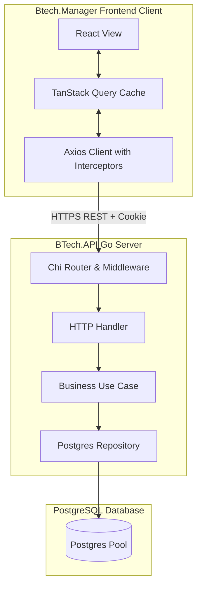

# BTech System Architecture Documentation

This document serves as the high-level system architecture and onboarding guide for the **BTech Fleet Control Platform**. It covers architectural boundaries, tenant isolation models, authentication structures, and system pipelines.

---

## High-Level Architecture Diagram

The BTech platform operates as a modern Single Page Application communicating with a stateless Go REST API backed by a PostgreSQL database.



---

## Backend Architecture

`BTech.API` follows the principles of **Clean Architecture**, enforcing strict dependency flow boundaries. The dependency rule dictates that source code dependencies can only point inward.

```
delivery (Handlers & DTOs) ──> usecase (Orchestrators) ──> domain (Entities) <── repository (PostgreSQL queries)
```

1. **Domain Layer (`internal/domain/`)**:
   - Represents the core business entities and logic.
   - Declares domain interfaces (e.g., `DriverRepository`, `TripRepository`).
   - Declares domain-specific errors (e.g., `ErrQuotaExceeded`, `ErrDriverNotFound`).
   - Contains no dependencies on external frameworks or databases (pure Go).
2. **Use Case Layer (`internal/usecase/`)**:
   - Contains application-specific business logic.
   - Orchestrates entities, checks permissions/entitlements, and invokes repository interfaces.
   - Has no knowledge of HTTP routing or SQL syntax.
3. **Repository Layer (`internal/repository/postgres/`)**:
   - Implements the repository interfaces defined in the Domain layer.
   - Writes SQL queries and maps rows to domain structs.
4. **Delivery Layer (`internal/delivery/http/`)**:
   - Handles the HTTP delivery protocol.
   - Decodes JSON request bodies, extracts context variables, calls use cases, and wraps outputs in standardized envelopes.

---

## Frontend Architecture

`Btech.Manager` is built as a modular React single page application:
- **Server State Management**: Server state caching, retries, and pagination are handled by **TanStack Query (React Query)**. Components access data through custom hooks (`src/hooks/`), preventing direct API call leakages inside the presentation layer.
- **Routing**: Client-side routing is handled by React Router DOM. Sensitive routes are wrapped inside `<RequirePermission>` elements.
- **API service layer**: Service functions wrap Axios calls to communicate with the REST API. An Axios response interceptor intercepts 401 errors to rotate access tokens programmatically.

---

## Multi-Tenant Context Flow

Multi-tenancy in BTech is organization-scoped. All user accounts belong to an organization, and all database tables containing tenant-scoped data carry an `organization_id` column.

Data separation is enforced at runtime via the following context propagation pipeline:

```
[HTTP Client Request] 
      │ (JWT Token in Authorization Header)
      ▼
[AuthMiddleware] ── Extract organization_id claim from JWT
      │
      ▼
[Go context.Context] ── Inject domain.OrganizationIDContextKey -> orgID
      │
      ▼
[HTTP Handler] ── Retrieve orgID from context, pass as first arg to UseCase
      │
      ▼
[UseCase Layer] ── Propagate orgID as parameter to Repository call
      │
      ▼
[Repository Query] ── Query SQL appends "WHERE organization_id = $1"
```

> [!CAUTION]
> **No database queries** against tenant-scoped tables must be performed without specifying the `WHERE organization_id` constraint. This acts as our primary defense against cross-tenant leaks.

---

## Authentication & Session Rotation (RTR)

Authentication is token-based. Sessions are renewed utilizing **Refresh Token Rotation (RTR)** to mitigate token theft risks:
- **Access Tokens**: Short-lived (e.g. 15 minutes) in-memory tokens containing `user_id`, `organization_id`, and `role`.
- **Refresh Tokens**: Long-lived (e.g. 7 days) tokens containing a unique `jti` nonce. Stored on the client inside a secure, `HttpOnly`, `SameSite=Strict` cookie.
- **Rotation Mechanics**:
  - When the client requests `/auth/refresh`, the server verifies the signature and checks the SHA-256 hash of the token against `user_sessions.token_hash`.
  - If valid, the server generates a new access token, rotates the refresh token (saving the new hash in the session record), and returns it to the user.
- **Replay Attack Protection**: If an old refresh token is reused, the server detects that the `token_hash` has already been superseded. The server immediately revokes the entire session family (`is_revoked = true`) and triggers a `session.compromised` audit log.

---

## Audit Logs Pipeline

BTech captures all state-changing activities using a standardized event pipeline:
1. When a use case executes a modifying operation, it invokes the `AuditUseCase.Log(ctx, action, entityType, entityID, metadata)` method.
2. The log function extracts `user_id`, `organization_id`, and client environment metadata (`ipAddress`, `userAgent`) from the propagated context.
3. Event taxonomy strings use dot-notation format: `{entity}.{action}` (e.g., `driver.create`, `maintenance.complete`).
4. Logs are stored in the `audit_logs` table, which is indexed for quick time-series filtering.
